# SKU 클러스터링 플로우 차트

## 전체 프로세스 플로우

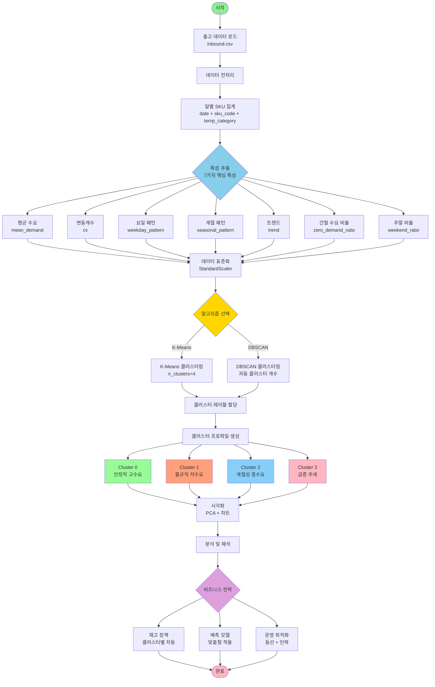

---

## 특성 추출 상세 플로우

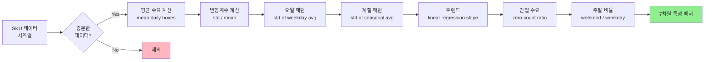

---

## K-Means 알고리즘 상세 플로우

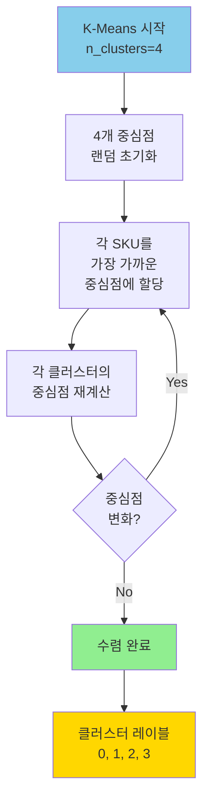

---

## DBSCAN 알고리즘 상세 플로우

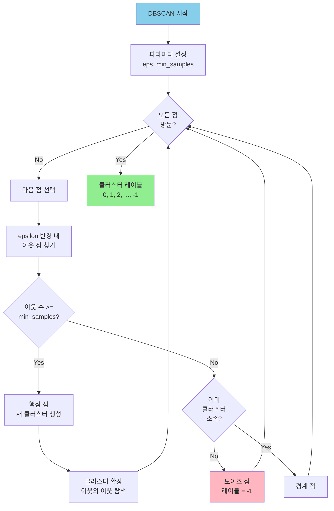

---

## 클러스터 분석 및 활용 플로우

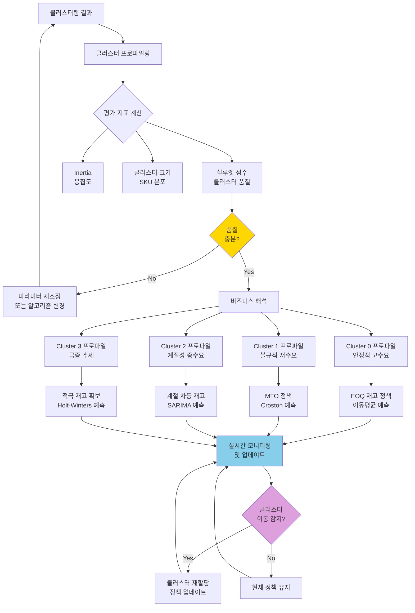

---

## 시각화 프로세스 플로우

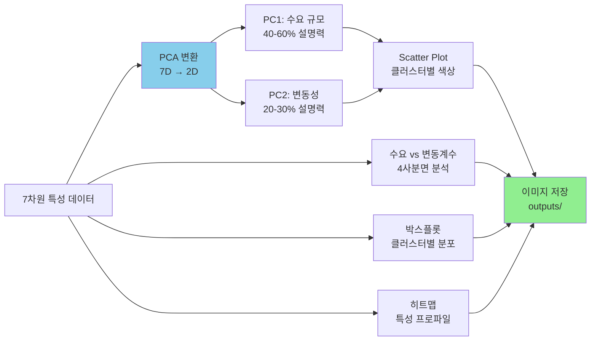

---

## 의사결정 지원 플로우

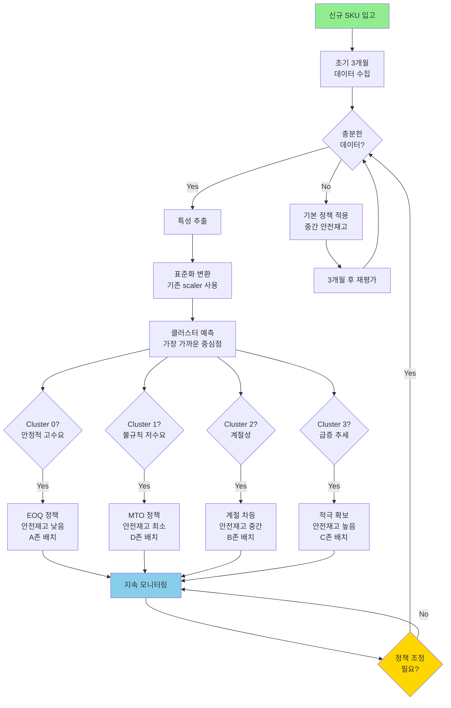

---

## 평가 및 개선 플로우

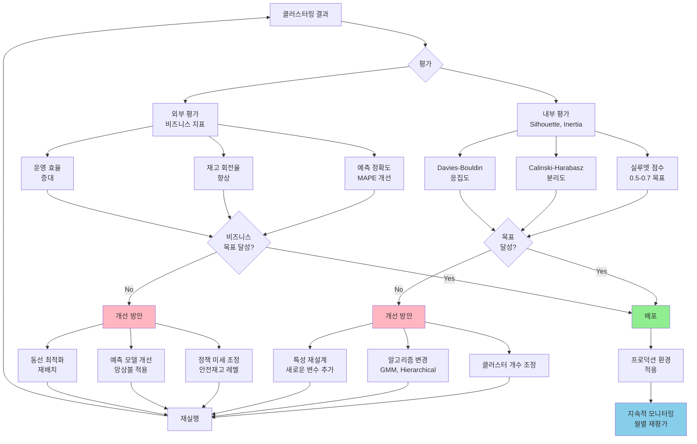

---

## 시스템 아키텍처

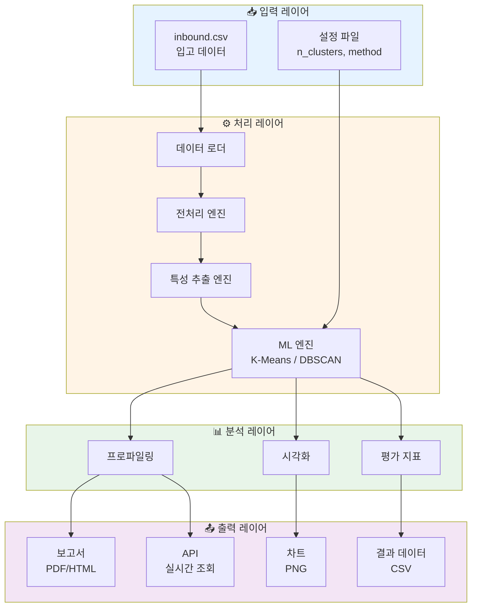

---

## 실시간 모니터링 플로우

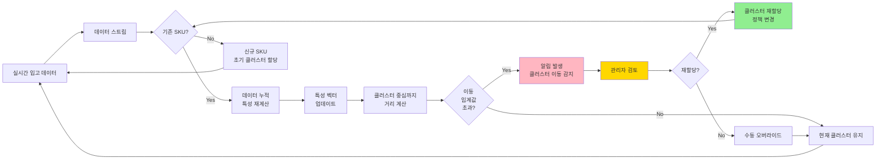

---

## 사용 방법

### 1. 기본 플로우 확인
전체 프로세스 플로우를 통해 시스템의 전반적인 흐름을 이해합니다.

### 2. 알고리즘별 상세 플로우
K-Means 또는 DBSCAN의 내부 동작 원리를 확인합니다.

### 3. 비즈니스 활용 플로우
클러스터링 결과를 실제 비즈니스에 적용하는 과정을 파악합니다.

### 4. 의사결정 지원 플로우
신규 SKU에 대한 자동 정책 할당 프로세스를 확인합니다.

---

## Mermaid 차트 렌더링 방법

### VS Code
1. "Markdown Preview Mermaid Support" 확장 설치
2. 마크다운 파일 열기
3. `Cmd/Ctrl + Shift + V`로 미리보기

### GitHub
- GitHub에서 자동으로 Mermaid 차트를 렌더링합니다

### 온라인 에디터
- https://mermaid.live/ 에서 코드 복사 후 렌더링

### Jupyter Notebook
```python
from IPython.display import display, Markdown

mermaid_code = """
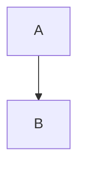
"""

display(Markdown(mermaid_code))
```

---

**문서 버전**: 1.0
**최종 업데이트**: 2024-01-XX
**작성자**: Logistics AI Team
